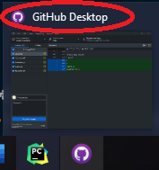

# **Universal-autorun**

### Autorun for chosen games

 Write to games.txt the name of the window you want the autorun to work in.

For example to use it in GTA5 go to games.txt and write the name of the window.
The window name is usually found as in the picture below.

### **Keybinds**

    "Right CTRL": Stops the auto-run

    "+": Holds "W" pressed.

    "+ and Numpad 8": Holds down "W" and "Numpad 8"

    "+ and Right Shift": Holds down "W" and "Shift"

### **To Run**

`pip install -r requirements.txt`

Run main.pyw